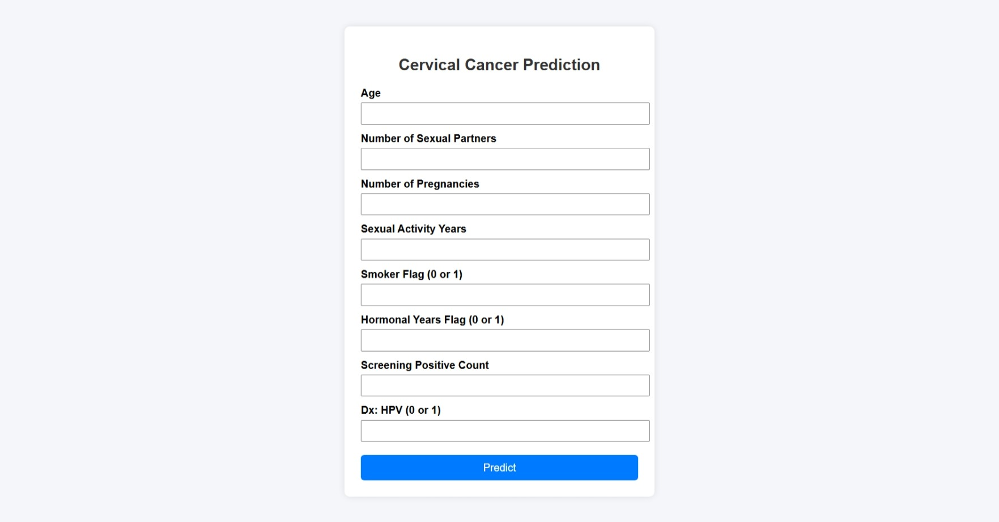

# Cervical Cancer Prediction Project

## Overview
This project aims to develop a predictive model for cervical cancer diagnosis utilizing various machine learning algorithms. The primary objective is to provide an efficient tool that assists healthcare professionals in diagnosing cervical cancer with higher accuracy.

## Features
- **Data Preprocessing**: Handles data cleaning and normalization.
- **Model Training**: Utilizes machine learning techniques to train models using historical data.
- **User-friendly Interface**: Provides an interface for users to input data and receive predictions.

## Installation
To get started, clone the repository:
```bash
git clone https://github.com/chandu-balla/cervical-cancer-prediction.git
```

## Usage
1. Install the required dependencies.
2. Run the application according to the guidelines provided.

## Screenshot
